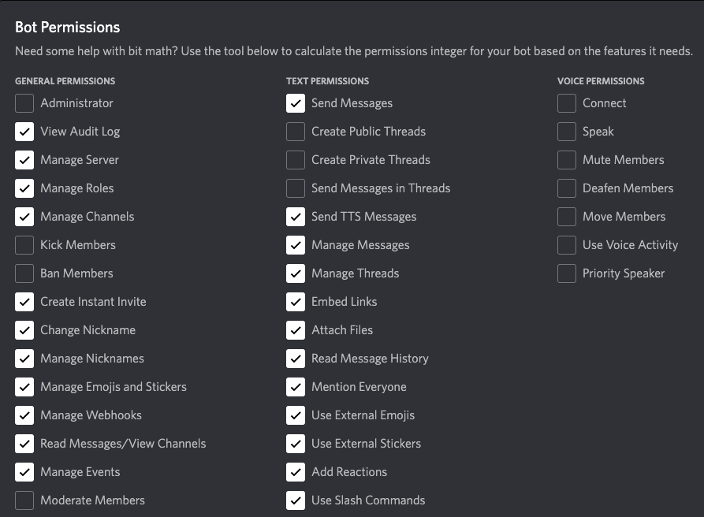

Meeting with Zac: [notes](https://roamresearch.com/#/app/egghead/page/FoO41nTrw)

## Discord Developer Portal
https://discord.com/developers/applications

- New Application
- Name: Book Club Bot
- Go to `Bot` section. 
- Click Add bot, hit yes

In OAuth2, click on URL Generator
- Select bot
- Select Permissions
  
- Copy the generated url and paste it in your browser. 
- Add it to your discord server.
- Click Authorize

Your bot is in your server!

## Initial setup for VSCode

- Create a new folder in vscode
- create a package.json
  ```json
  "name": "Book Club Bot",
  "private": true,
  "main": "main.js",
  "license": "MIT",
  "type": "module",
  "engines": {
    "node": ">=16.9.0"
  },
  ```
- install dotenv for env files
- create .env file
- Create variable called `BOT_TOKEN`
- back in the dev portal, in the bot section, click reset token and copy it
- Past it in .env
- Install discord.js@14.1.2 and nodemon@2.0.15 (discord.js requires node v16.9.0 or higher)
- Write script for starting nodemon for development
  
## Main.js
- Import discord.js and dotenv
- add dotenv.config()
- Setup Client and Intents
- Login with env bot token
- Write your first response with client.once

The bot is now running. 


## Registering slash commands
### deploy-commands.js
- install @discordjs/rest
- Add CLIENT_ID and GUILD_ID to .env file
- Create deploy commands file
- Add imports to file
- Create commands array
  - fill with first slash command
- Create new rest
- Create `put` to register your commands
- run file

(You're going to want to add a #bot-channel to your discord so you aren't constantly pinging your other users with new messages when you're testing your bot.)

## Reply to commands
### main.js
- Create new interaction
  - `client.on('interactionCreate', async interaction => {...}`
  - Add condition if the slash command from the user doesn't match anything
    - `if (!interaction.isChatInputCommand()) return;`
  - Destructure the `commandName` form the interaction.
    - `const { commandName } = interaction;`
  - Add if conditional for the ping command
    - `if (commandName === 'ping'){}`
  - Add the reply
    - `await interaction.reply('Pong!')`

## Get user input
### main.js
- Create new command `newbookclub`
- Have the bot ask questions
- Use `awaitMessages` to collect user responses
- Assign those to variables
- Create embed message with the answers the user gave
- Return that embed in a new `interaction.followUp`

## Get users by reaction
### main.js
- Add `GuildMessageReactions` to your intents
- Assign embedded message to variable
- embedded message .react('emoji')
- Create a filter with your emoji and the user not being a bot
- embedded message `.createReactionCollector` with filter, max, and time set to a variable called collector
- collector.on collect, then collector.on end

## Add role to user that reacts
### main.js
- Create unique dynamic role
```js
interaction.guild.roles.create({ 
  name: `${book}`
})
```
- Create unique dynamic channel
```js
interaction.guild.channels.create({ 
  name: `${book}`,
  type: ChannelType.GuildText,
  permissionOverwrites: [
    {
      id: interaction.guild.id,
      deny: [PermissionsBitField.Flags.ViewChannel]
    }
  ]
})
```
- Add role to user that reacts
```js
const userById = interaction.guild.members.cache.get(user.id)
userById.roles.add(newRole.id)
```

## Add role to channel
### main.js
```js
bookClubChannel.permissionOverwrites.create(interaction.guild.roles.cache.find(r => r.name === book).id, {ViewChannel: true})
```
- You need to allow your bot to have the scope of applications.commands in the discord portal. 
- Kick your bot and re-add it with both the `bot` and `applications.commands` scopes added. 
- You'll also have to re-register your slash commands with `node deploy-commands.js`
- 